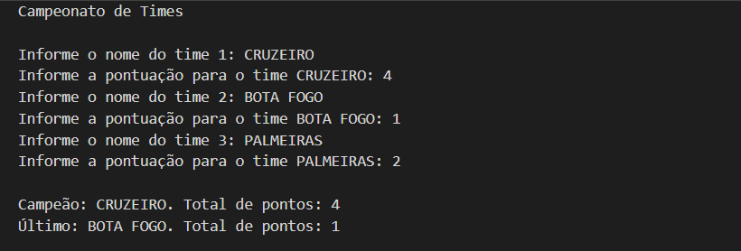

# CAMPEONATO DE TIMES
👨‍🏫ESTE PROGRAMA CALCULA E APRESENTA OS RESULTADOS DE UM CAMPEONATO DE TIMES COM BASE NAS ENTRADAS FORNECIDAS PELO USUÁRIO.

  

## DESCRIÇÃO:
Este programa em Portugol lê duas listas de 3 elementos cada:
- A primeira lista contém os nomes dos times.
- A segunda lista contém a pontuação dos times.
Ao final, o programa apresenta na tela o time campeão (com sua pontuação) e o último colocado (com sua pontuação) no campeonato.

## FUNCIONALIDADES:
1. **Entrada de Dados Validada**:
   - O programa solicita ao usuário que insira o nome e a pontuação de três times.
   - Cada pontuação inserida é validada para garantir que seja um número real válido.

2. **Determinação do Campeão e Último Colocado**:
   - Após a entrada dos dados, o programa identifica automaticamente qual time tem a maior pontuação (campeão) e qual tem a menor pontuação (último colocado).

3. **Saída do Resultado**:
   - Exibe na tela o nome do time campeão com sua pontuação e o nome do último colocado com sua pontuação.

## COMO USAR?
1. **Execução do Programa**:
   - Abra o Portugol Studio.
   - Crie um novo projeto e cole o código fornecido.
   - Compile e execute o programa.

2. **Interagindo com o Programa**:
   - Ao iniciar, o programa solicitará que você insira o nome e a pontuação de três times.
   - Digite o nome de cada time e sua respectiva pontuação.
   - O programa verificará se a pontuação é válida (não negativa).
   - Após inserir os dados dos três times, o programa determinará automaticamente qual é o time campeão (com a maior pontuação) e qual é o último colocado (com a menor pontuação).
   - Em seguida, exibirá na tela o nome do time campeão com sua pontuação e o nome do último colocado com sua pontuação.

## NÃO SABE?
- Entendemos que para manipular arquivos em muitas linguagens e tecnologias, é necessário possuir conhecimento nessas áreas. Para auxiliar nesse aprendizado, oferecemos cursos gratuitos disponíveis:
* [CURSO DE PORTUGOL](https://github.com/VILHALVA/CURSO-DE-PORTUGOL)
* [CONFIRA MAIS CURSOS](https://github.com/VILHALVA?tab=repositories&q=+topic:CURSO)

## CREDITOS:
- [PROJETO CRIADO PELO VILHALVA](https://github.com/VILHALVA)

